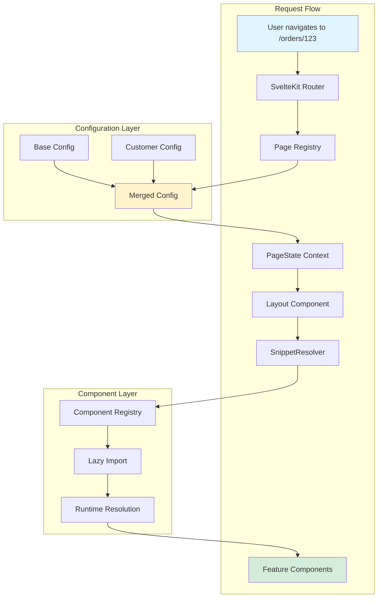
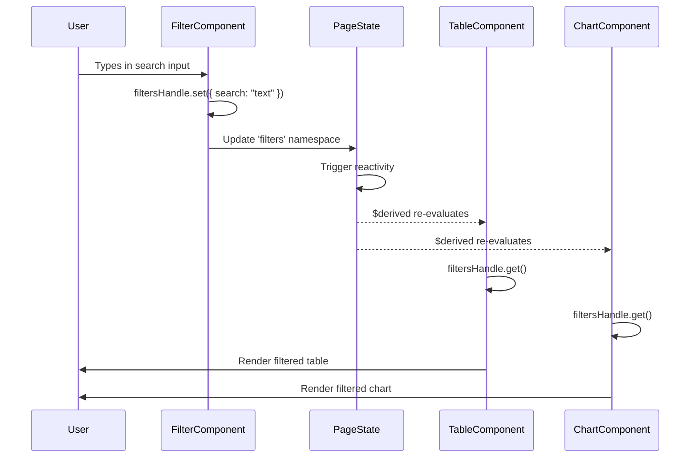
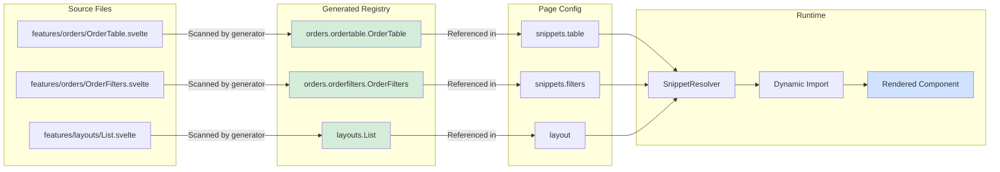
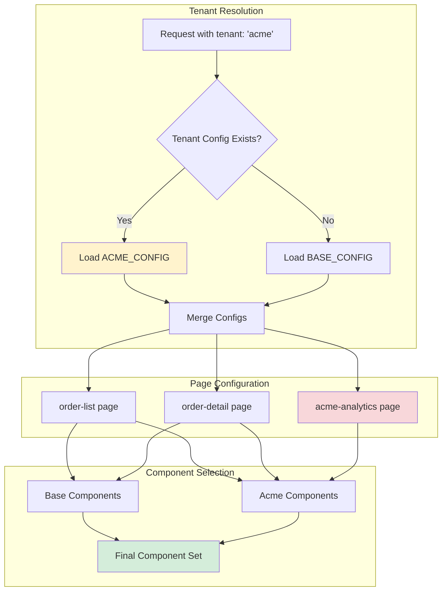

# Snapkit Architecture

Snapkit is an AI-assisted customization framework for ERP systems built on SvelteKit, TypeScript, and shadcn-svelte. It implements a **declarative page architecture** with **dynamic component resolution** and **typed state sharing** between components.

## Design Goals

1. **Declarative Page Configuration** - Define pages via metadata, not scattered route files
2. **Composable Layouts** - Plug any component into any layout slot
3. **Decoupled Component Communication** - Components share state without importing each other
4. **Abstract Page References** - Reference pages by `$id`, not hardcoded URLs
5. **AI-Friendly Development** - MCP servers provide context for AI-assisted building

---

## AI-Assisted Customization Architecture

Snapkit is designed to leverage AI assistance throughout its development lifecycle, from component discovery to customer-specific customizations. This architecture enables both developers and AI agents to understand, navigate, and extend the system efficiently.

### MCP Server Ecosystem

The project integrates multiple **Model Context Protocol (MCP) servers** that provide structured context to AI assistants. These servers transform the codebase into a queryable knowledge base:

#### Active MCP Servers

| Server | Context Provided | Use Cases |
|--------|------------------|-----------|
| **svelte** | Svelte 5 & SvelteKit documentation | Framework-specific patterns, runes syntax, reactivity rules |
| **shadcn-svelte** | Base UI component library docs | Available primitives, component APIs, styling patterns |
| **shadcn-svelte-extras** | Extended component library (via jsrepo) | Additional UI patterns not in core library |
| **svelte-components** | Live component registry discovery | Find existing components, explore contracts, understand bindings |
| **arke** | Backend API exploration | Available endpoints, request/response schemas, data models |

#### AI-Assisted Development Workflows

**1. Component Discovery**
```
Developer: "Is there a component for filtering orders?"
AI (via svelte-components MCP): 
  → Searches component registry
  → Finds orders.orderfilters.OrderFilters
  → Shows contract: provides { filters: { search, status } }
  → Suggests usage in page config
```

**2. Automatic Code Fixes**
The `svelte-autofixer` tool uses MCP context to:
- Detect Svelte 5 syntax violations
- Suggest runes-based refactorings
- Fix common reactivity issues
- Align code with framework best practices

**3. API-Driven Development**
```
Developer: "Create a component to display material stock levels"
AI (via arke MCP):
  → Discovers /api/materials/:id/stock endpoint
  → Generates typed fetch utilities
  → Scaffolds component with proper error handling
  → Creates contract for state sharing
```

### OpenAPI Vectorization (Exploratory)

**Concept**: Convert OpenAPI specifications into vector embeddings to enable semantic search over API documentation.

**Workflow**:
1. Parse OpenAPI/Swagger file from backend
2. Extract endpoint descriptions, parameters, response schemas
3. Generate embeddings using text-embedding models
4. Store in vector database (or in-memory for prototyping)
5. Enable natural language queries: "How do I update order status?" → `/orders/:uuid/status PATCH`

**MCP Integration**:
- Create custom MCP server that wraps the vector store
- AI can query: "Show me all endpoints related to inventory management"
- Returns relevant endpoints with full schema context

**Status**: 🔬 Experimental - not yet implemented

### Customer-Specific Customization Strategy

The architecture supports **tenant-specific variations** without forking the codebase:

#### Customization Layers

```
┌─────────────────────────────────────┐
│   Customer Configuration Layer       │  ← Per-tenant page registry config
├─────────────────────────────────────┤
│   Base Page Registry                │  ← Default pages for all customers
├─────────────────────────────────────┤
│   Component Registry                │  ← Shared component pool
├─────────────────────────────────────┤
│   shadcn-svelte Base UI             │  ← Foundational primitives
└─────────────────────────────────────┘
```

#### AI-Assisted Customization Flow

**Scenario**: Customer "Acme Corp" needs order approval workflow not present in base ERP.

```
1. Developer describes requirement to AI
   → "Acme needs 2-stage approval for orders over €10k"

2. AI (via MCP servers):
   → Checks existing components for approval patterns
   → Discovers orders.OrderApprovalButton doesn't exist
   → Queries arke MCP for /orders/:uuid/approve endpoint
   → Finds endpoint exists with proper schema

3. AI generates:
   → OrderApprovalButton.svelte component
   → OrderApprovalButton.contract.ts with approval state
   → Registers in component registry
   
4. Developer adds to Acme's page config:
   {
     $id: 'order-detail',
     snippets: {
       actions: {
         componentKey: 'orders.orderapprovalbutton.OrderApprovalButton',
         enabled: true  // Only for Acme tenant
       }
     }
   }
```

### Dynamic Component Suggestions

Future capability: AI suggests components based on user intent and available API endpoints.

**Example**:
```
User adds new API endpoint: POST /materials/bulk-import
AI detects:
  → New bulk operation available
  → No corresponding UI component exists
  → Suggests: "Create materials.BulkImportDialog component?"
  → Generates scaffold with:
    - File upload handling
    - Progress tracking state
    - Error display contract
```

### Benefits of AI-Integrated Architecture

| Benefit | Description |
|---------|-------------|
| **Reduced Onboarding Time** | New developers query AI instead of reading docs |
| **Consistent Patterns** | AI suggests solutions aligned with existing architecture |
| **Faster Customization** | Customer-specific features scaffolded in minutes |
| **Living Documentation** | MCP servers always reflect current codebase state |
| **API-UI Alignment** | Components automatically match backend capabilities |

---

## Multi-Tenancy & Customer Configuration

Snapkit implements a **configuration-driven multi-tenancy model** where each customer receives a tailored ERP experience without requiring separate codebases or deployments.

### Tenancy Model

#### Single Codebase, Multiple Configurations

```
                    Shared Snapkit Core
                            │
        ┌───────────────────┼───────────────────┐
        │                   │                   │
   Customer A          Customer B          Customer C
   Config Layer        Config Layer        Config Layer
   ├─ Page Config      ├─ Page Config      ├─ Page Config
   └─ Feature Flags    └─ Feature Flags    └─ Feature Flags
```

All customers share:
- Component registry
- Core routing system
- State management infrastructure
- Base UI components

Each customer customizes:
- Which pages are available (add/remove)
- Which snippets appear on each page
- Component bindings and data flows

### Configuration System

#### Base Configuration (Starting Point)

```typescript
// src/lib/utils/page-registry.ts
export const BASE_PAGE_REGISTRY: PageConfig[] = [
  {
    $id: 'order-list',
    title: 'Orders',
    route: '/orders',
    layout: { componentKey: 'layouts.List', enabled: true },
    snippets: {
      title: { componentKey: 'globals.PageTitle', enabled: true },
      filters: { componentKey: 'orders.OrderFilters', enabled: true },
      table: { componentKey: 'orders.OrderTable', enabled: true }
    }
  },
  // ... more pages
]
```

#### Customer-Specific Configuration

```typescript
// src/lib/configs/customers/acme-corp.ts
export const ACME_CONFIG: PageConfig[] = [
  // Modify existing page from base
  {
    $id: 'order-list',
    title: 'Orders',
    route: '/orders',
    layout: { componentKey: 'layouts.List', enabled: true },
    snippets: {
      title: { componentKey: 'globals.PageTitle', enabled: true },
      filters: { componentKey: 'orders.OrderFilters', enabled: true },
      // Different table implementation
      table: { 
        componentKey: 'orders.acme.AcmeOrderTable', 
        enabled: true 
      },
      // Add new snippet not in base
      exportButtons: { 
        componentKey: 'orders.acme.AcmeExportButtons', 
        enabled: true 
      }
    }
  },
  // Add entirely new page (not in base)
  {
    $id: 'acme-analytics',
    title: 'Acme Analytics Dashboard',
    route: '/analytics',
    layout: { componentKey: 'layouts.Dashboard', enabled: true },
    snippets: {
      charts: { componentKey: 'acme.AnalyticsCharts', enabled: true }
    }
  }
  // Note: pages from BASE_PAGE_REGISTRY not listed here are excluded
]
```

#### Runtime Resolution

```typescript
// Pseudo-code for configuration resolution
function getPageRegistry(tenantId: string): PageConfig[] {
  if (tenantId === 'default') {
    return BASE_PAGE_REGISTRY
  }
  
  const customerConfig = CUSTOMER_CONFIGS[tenantId]
  return customerConfig || BASE_PAGE_REGISTRY
  
  // Each customer has full control:
  // - Can include all base pages (copy from base)
  // - Can modify base pages (change snippets)
  // - Can add new pages (unique to customer)
  // - Can exclude base pages (simply don't include them)
}
```

### Feature Flags per Tenant

Components can be toggled on/off per customer using the `enabled` flag:

```typescript
// Customer A: Show advanced filters
{
  $id: 'order-list',
  snippets: {
    advancedFilters: { 
      componentKey: 'orders.AdvancedFilters', 
      enabled: true  // ✅ Visible for Customer A
    }
  }
}

// Customer B: Hide advanced filters (not ready yet)
{
  $id: 'order-list',
  snippets: {
    advancedFilters: { 
      componentKey: 'orders.AdvancedFilters', 
      enabled: false  // ❌ Hidden for Customer B
    }
  }
}
```

### Component Variants

Different customers can use different implementations of the same logical component:

```
Standard Customer:
  orders.OrderTable  → Basic table with pagination

Premium Customer:
  orders.premium.PremiumOrderTable  → Table + real-time updates + export

Enterprise Customer:
  orders.enterprise.EnterpriseOrderTable  → Full features + custom columns + API access
```

**Example**:
```typescript
// Standard customer config
snippets: {
  table: { componentKey: 'orders.OrderTable', enabled: true }
}

// Enterprise customer config
snippets: {
  table: { componentKey: 'orders.enterprise.EnterpriseOrderTable', enabled: true }
}
```

Both use the same slot (`table`) but render different components based on tenant configuration.

### Namespace Isolation in State Sharing

Customer-specific components can use isolated namespaces to avoid state collisions:

```typescript
// Standard filter: uses 'filters' namespace
const filtersHandle = useProvides(StandardFiltersContract, 'filters')

// Acme custom filter: uses 'acme.filters' namespace
const filtersHandle = useProvides(AcmeFiltersContract, 'acme.filters')
```

Bindings ensure proper wiring:
```typescript
{
  componentKey: 'orders.acme.AcmeOrderTable',
  bindings: {
    consumes: { 
      filters: 'acme.filters'  // Remap to customer-specific namespace
    }
  }
}
```

### Tenant Context

**Planned Feature**: A tenant context provider that makes customer identity available throughout the app.

```typescript
// Future API
import { getTenantId, getTenantConfig } from '$lib/contexts/tenant'

const tenantId = getTenantId()  // → 'acme-corp'
const config = getTenantConfig()  // → { name: 'Acme Corp', features: [...] }
```

This would enable:
- Runtime feature checks: `if (config.features.includes('advanced-analytics'))`
- Conditional rendering: `{#if tenantId === 'acme-corp'}`
- Tenant-specific API headers

### Customer Onboarding Workflow

**Current Process** (manual):
1. Create `src/lib/configs/customers/[customer-slug].ts`
2. Define complete page configuration (starting from base or from scratch)
3. Add/remove pages as needed
4. Register customer config in tenant registry
5. Deploy with customer-specific environment variable

**Future Process** (AI-assisted):
1. Describe customer requirements in natural language
2. AI generates configuration file based on base config
3. AI suggests existing components or scaffolds new ones
4. Developer reviews and commits configuration
5. Automated deployment pipeline picks up new tenant

### Multi-Tenant Data Isolation

**Note**: This architecture focuses on **UI/UX customization**. Backend data isolation (database tenancy, API access control) is handled by the Arke backend system and is outside the scope of Snapkit.

Snapkit assumes:
- Backend enforces tenant isolation at API level
- Each request includes tenant authentication
- API responses are already filtered for current tenant

### Example: Two Customers, One Page

**Customer A** (Standard Tier):
```
URL: /orders
Components visible:
  → PageTitle: "Orders"
  → OrderFilters: Basic search + status
  → OrderTable: 10 columns, pagination
```

**Customer B** (Enterprise Tier):
```
URL: /orders
Components visible:
  → PageTitle: "Order Management"
  → OrderFilters: Advanced filters + saved searches
  → OrderTable: 15 columns, real-time updates, bulk actions
  → ExportButtons: CSV, Excel, PDF export
  → AnalyticsWidget: Quick stats dashboard
```

Same route, same layout, different snippets and component implementations.

### Benefits

| Benefit | Description |
|---------|-------------|
| **Single Deployment** | One codebase serves all customers |
| **Rapid Customization** | New customer = new config file, not new codebase |
| **Shared Improvements** | Bug fixes and features propagate to all customers |
| **A/B Testing** | Easy to test new components with subset of customers |
| **Gradual Rollouts** | Enable features per customer, not all-at-once |

---

## Code Generation Explorations

**Status**: 🔬 Experimental - inspiration phase, not yet implemented

### Learnings from Fabrix

[Fabrix](https://github.com/fivethree-team/fabrix) (archived project) demonstrated an interesting approach to generating UI components from data schemas. While Fabrix itself is no longer actively maintained, its core concepts offer valuable insights for Snapkit's future code generation capabilities.

### Core Concept

Generate **selected generic components** (not entire UIs) from JSON schemas that describe:
1. The data model the component will receive
2. Custom renderers for specific fields
3. Layout and presentation hints

**Example Use Case**: Generic table component

```json
{
  "component": "DataTable",
  "model": {
    "type": "array",
    "items": {
      "type": "object",
      "properties": {
        "id": { "type": "string" },
        "name": { "type": "string" },
        "status": { 
          "type": "string",
          "enum": ["pending", "approved", "rejected"]
        },
        "amount": { "type": "number" },
        "createdAt": { "type": "string", "format": "date-time" }
      }
    }
  },
  "renderers": {
    "status": "StatusBadge",
    "amount": "CurrencyFormatter",
    "createdAt": "RelativeDate"
  },
  "layout": {
    "columns": ["name", "status", "amount", "createdAt"],
    "sortable": ["name", "amount", "createdAt"],
    "filterable": ["status"]
  }
}
```

### Selective Generation Philosophy

**Not everything should be generated**. The approach focuses on:

**Good candidates for generation**:
- Generic data display components (tables, lists, grids)
- Form scaffolds from API schemas
- CRUD operation boilerplate
- Type-safe API client wrappers

**Poor candidates for generation**:
- Business logic components
- Complex interactions and workflows
- Customer-specific customizations
- Layout components

### Integration with Snapkit

**Potential workflow**:
1. Backend API exposes OpenAPI schema
2. Developer selects specific endpoints to "componentize"
3. Schema analyzer suggests appropriate component types
4. JSON schema generated describing the component's data model
5. Developer annotates with custom renderers
6. Code generator produces:
   - Component `.svelte` file
   - Component contract (if state sharing needed)
   - TypeScript types derived from schema

**Example Output**:
```svelte
<!-- Generated: OrderTable.svelte -->
<script lang="ts">
  import type { Order } from '$lib/types/generated'
  import { StatusBadge } from '$lib/components/ui/status-badge'
  import { CurrencyFormatter } from '$lib/components/ui/currency'
  
  const { orders }: { orders: Order[] } = $props()
</script>

<table>
  {#each orders as order}
    <tr>
      <td>{order.name}</td>
      <td><StatusBadge status={order.status} /></td>
      <td><CurrencyFormatter amount={order.amount} /></td>
      <td>{new Date(order.createdAt).toLocaleDateString()}</td>
    </tr>
  {/each}
</table>
```

### Schema-Driven Component Metadata

Generated components could include metadata for AI discovery:

```typescript
// OrderTable.meta.ts (generated alongside component)
export const metadata = {
  generatedFrom: '/api/orders',
  dataModel: 'Order[]',
  capabilities: ['sorting', 'filtering', 'pagination'],
  customRenderers: ['StatusBadge', 'CurrencyFormatter'],
  lastGenerated: '2024-01-15T10:30:00Z'
}
```

This metadata could be consumed by MCP servers to help AI assistants understand component capabilities.

### Open Questions

- **Regeneration strategy**: How to handle manual edits when schema changes?
- **Renderer library**: Should there be a curated set of "approved" renderers?
- **Validation**: How to ensure generated components follow Snapkit patterns?
- **Version control**: How to track schema → component relationships?

### Next Steps

1. Prototype a simple table generator from OpenAPI schema
2. Evaluate developer experience and code quality
3. Determine which component types benefit most from generation
4. Build renderer annotation DSL
5. Integrate with component registry auto-discovery

---

## Core Systems

### 1. Page Registry

The page registry (`src/lib/utils/page-registry.ts`) is the declarative layer defining all pages in the system.

```typescript
interface PageConfig {
  $id: string                              // Unique identifier for route generation
  $params?: TObject                        // TypeBox schema for route parameters
  title: string                            // Display title
  route: string                            // Route pattern (e.g., '/orders/:uuid')
  layout: SnippetDefinition               // Layout component to render
  snippets: Record<string, SnippetDefinition>  // Named content slots
}

interface SnippetDefinition {
  componentKey: ComponentKey              // Reference to component registry
  enabled: boolean                        // Feature flag
  bindings?: BindingConfig               // Namespace mapping for state
}
```

**Example:**
```typescript
{
  $id: 'order-detail',
  $params: Type.Object({ uuid: Type.String() }),
  title: 'Order Detail',
  route: '/orders/:uuid',
  layout: { componentKey: 'layouts.Detail', enabled: true },
  snippets: {
    header: { componentKey: 'orders.DetailHeader', enabled: true },
    items: { componentKey: 'orders.ItemsTable', enabled: true }
  }
}
```

**Route Matching:**
Uses `path-to-regexp` for pattern matching. The `getPageByRoute()` function matches incoming URLs against registered patterns and extracts parameters.

---

### 2. Route Builder

The route builder (`src/lib/utils/route-builder.ts`) generates URLs from page `$id`s, eliminating hardcoded URLs.

```typescript
import { createRoute } from '$lib/utils/route-builder'

// Without parameters
createRoute({ $id: 'order-list' })
// → '/orders'

// With path parameters
createRoute({ $id: 'order-detail', params: { uuid: '123' } })
// → '/orders/123'

// With query parameters
createRoute({ $id: 'order-list', query: { status: 'pending', page: 1 } })
// → '/orders?status=pending&page=1'
```

**Performance:**
Compiled route functions are cached in a `Map` to avoid recompilation on each call.

**Validation:**
In development mode, parameters are validated against the TypeBox `$params` schema.

---

### 3. Component Registry

The component registry (`src/generated/components-registry.ts`) is auto-generated by scanning `src/lib/components/features/`.

```typescript
export const COMPONENT_REGISTRY = {
  'orders.pagetable.default.PageTable': {
    component: () => import('$lib/components/features/orders/PageTable/default/PageTable.svelte'),
    description: 'PageTable component'
  },
  'layouts.List': {
    component: () => import('$lib/components/features/layouts/List.svelte'),
    description: 'List layout'
  },
  // ...
} as const

export type ComponentKey = keyof typeof COMPONENT_REGISTRY
```

**Key Naming Convention:**
- Path: `src/lib/components/features/orders/PageFilters/default/PageFilters.svelte`
- Key: `orders.pagefilters.default.PageFilters`

**Regeneration:**
```bash
npm run generate:components-registry
```

---

### 4. State Sharing System

Located in `src/lib/contexts/page-state/`, this system enables typed communication between components without direct imports.

#### Core Concepts

| Concept | Description |
|---------|-------------|
| **PageState** | Central reactive store for all component state within a page |
| **ComponentContract** | Describes what a component provides and consumes |
| **Bindings** | Maps logical names to actual namespaces |
| **StateHandle** | Typed interface for reading/writing state |

#### Component Contract

```typescript
import { Type } from '@sinclair/typebox'
import type { ComponentContract } from '$lib/contexts/page-state'

export const FilterContract = {
  $id: 'FilterComponent',
  provides: {
    filters: Type.Object({
      search: Type.String(),
      status: Type.Array(Type.String())
    })
  },
  consumes: {}
} as const satisfies ComponentContract
```

#### Using State Handles

**Provider (writes state):**
```typescript
import { useProvides } from '$lib/contexts/page-state'

const filtersHandle = useProvides(FilterContract, 'filters')

// Set state
filtersHandle.set({ search: 'query', status: ['pending'] })

// Update state
filtersHandle.update(current => ({ ...current, status: ['shipped'] }))
```

**Consumer (reads state):**
```typescript
import { useConsumes } from '$lib/contexts/page-state'

const filtersHandle = useConsumes(TableContract, 'filters')

// Read state (may be undefined)
const filters = filtersHandle.get()

// Use in derived
const filteredItems = $derived.by(() => {
  const f = filtersHandle.get()
  return f ? items.filter(matchesFilter(f)) : items
})
```

#### Bindings Configuration

Bindings map logical names to actual PageState namespaces:

```typescript
// In page registry
{
  componentKey: 'orders.Table',
  bindings: {
    consumes: { filters: 'search.filters' }  // Remap 'filters' to 'search.filters'
  }
}
```

Default behavior: logical name equals namespace (e.g., `filters` → `filters`).

---

### Advanced State Sharing Patterns

#### Multi-Consumer Pattern

Multiple components consuming the same state:

```typescript
// Filters component provides state
const filtersHandle = useProvides(FiltersContract, 'filters')

// Table consumes for filtering
const tableFilters = useConsumes(TableContract, 'filters')

// Chart consumes for visualization
const chartFilters = useConsumes(ChartContract, 'filters')

// Export button consumes for file generation
const exportFilters = useConsumes(ExportContract, 'filters')
```

**Flow**:
```
User changes filter
       ↓
FiltersHandle.set({ ... })
       ↓
PageState updates
       ↓
Svelte reactivity triggers
       ↓
Table, Chart, Export all re-derive
```

#### Side Effects with $effect

```typescript
import { useProvides } from '$lib/contexts/page-state'

const searchHandle = useProvides(SearchContract, 'search')

let query = $state('')
let debounceTimer: ReturnType<typeof setTimeout> | null = null

// Debounced search
$effect(() => {
  if (debounceTimer) clearTimeout(debounceTimer)
  
  debounceTimer = setTimeout(() => {
    searchHandle.set({ query, timestamp: Date.now() })
  }, 300)
  
  return () => {
    if (debounceTimer) clearTimeout(debounceTimer)
  }
})
```

#### Derived State from Multiple Sources

```typescript
const filtersHandle = useConsumes(Contract, 'filters')
const sortHandle = useConsumes(Contract, 'sort')
const paginationHandle = useConsumes(Contract, 'pagination')

const displayedItems = $derived.by(() => {
  const filters = filtersHandle.get()
  const sort = sortHandle.get()
  const pagination = paginationHandle.get()
  
  let result = items
  
  if (filters) {
    result = result.filter(matchesFilters(filters))
  }
  
  if (sort) {
    result = result.sort(sortComparator(sort))
  }
  
  if (pagination) {
    const start = (pagination.page - 1) * pagination.pageSize
    result = result.slice(start, start + pagination.pageSize)
  }
  
  return result
})
```

#### Debugging State Sharing

**Common Issues:**

1. **State not updating**: Check if provider is calling `.set()` or `.update()`
2. **Consumer gets undefined**: Check if provider's namespace matches consumer's binding
3. **Stale state**: Ensure consumer is using `$derived` not just reading once
4. **Performance issues**: Avoid expensive computations in derived, use memoization

**Debug Helper:**
```typescript
// Add to component for debugging
$effect(() => {
  console.log('Filters changed:', filtersHandle.get())
})
```

#### Performance Considerations

**Good Practices:**
- Keep state slices small and focused
- Use separate namespaces for unrelated data
- Derive state lazily with `$derived.by()`
- Avoid deep object nesting in state

**Anti-patterns:**
- Storing entire API responses in state (use derived views instead)
- Sharing computed arrays/objects (derive them per-consumer)
- Bi-directional bindings without clear ownership

---

### 5. Runtime Resolution

#### SnippetResolver

`src/lib/components/runtime/SnippetResolver.svelte` dynamically loads and renders components:

1. Lazy loads component from registry
2. Checks for exported `contract`
3. If contract exists, wraps in `SnippetBindingsProvider`
4. Renders component with snippet props context

```svelte
<SnippetResolver snippet={config.snippets.filters} />
```

#### SnippetBindingsProvider

Sets up bindings context for components with contracts, resolving logical names to namespaces.

---

### 6. Layout System

Layouts are components that define page structure and render snippets into slots.

**List Layout** (`layouts.List`):
```svelte
<AppHeader />
<main>
  <SnippetResolver snippet={config.snippets.title} />
  <SnippetResolver snippet={config.snippets.filters} />
  <SnippetResolver snippet={config.snippets.table} />
</main>
```

**Detail Layout** (`layouts.Detail`):
```svelte
<main>
  <SnippetResolver snippet={config.snippets.header} />
  <SnippetResolver snippet={config.snippets.content} />
</main>
```

---

## Architecture Diagrams

### System Overview



### State Sharing Flow



### Component Registry Relationships



### Multi-Tenant Configuration



---

## Data Flow

### Page Load

```
User navigates to /orders/123
         ↓
SvelteKit matches [...path] route
         ↓
+page.ts calls getPageByRoute('/orders/123')
         ↓
Route pattern /orders/:uuid matches → params: { uuid: '123' }
         ↓
+page.svelte initializes PageState context
         ↓
SnippetResolver loads layout component
         ↓
Layout renders snippets via SnippetResolver
         ↓
Components mount with state handles available
```

### State Sharing

```
FilterComponent mounts
         ↓
useProvides(FilterContract, 'filters') creates handle
         ↓
User types in search input
         ↓
filtersHandle.set({ search: 'text', status: [] })
         ↓
PageState updates internal $state
         ↓
Svelte reactivity triggers
         ↓
TableComponent's $derived re-evaluates
         ↓
filtersHandle.get() returns new filter state
         ↓
Table re-renders with filtered items
```

---

## MCP Server Integration (Expanded)

The project uses multiple MCP servers configured in `CLAUDE.md`:

| Server | Purpose | AI Use Cases |
|--------|---------|--------------|
| **svelte** | Svelte 5 & SvelteKit documentation | Framework questions, runes syntax, reactivity debugging |
| **shadcn-svelte** | Base UI component docs | "What components are available?", styling patterns |
| **shadcn-svelte-extras** | Extra components via jsrepo | Extended UI patterns beyond core library |
| **svelte-components** | Feature component discovery | "Is there a component for X?", contract exploration |
| **arke** | Backend API exploration | "What endpoints exist?", schema discovery |

### Practical AI-Assisted Development

#### Using svelte-autofixer

```bash
# AI detects Svelte 5 violations and suggests fixes
$ svelte-autofixer src/lib/components/features/orders/OrderTable.svelte

Found issues:
  - Line 12: Using $: reactive statement (deprecated in Svelte 5)
  - Line 18: Using export let (should use $props())
  
Suggested fixes:
  - Replace $: with $derived
  - Replace export let with const { prop } = $props()
  
Apply fixes? [Y/n]
```

#### Component Discovery Workflow

**Developer prompt to AI:**
```
"I need to display a list of materials with filtering. Is there already a component for this?"
```

**AI uses svelte-components MCP:**
```typescript
// AI queries component registry
searchComponents({ query: "materials", type: "table" })

// Finds:
// - materials.MaterialsTable
// - materials.MaterialsFilters

// AI responds:
"Yes! There's materials.MaterialsTable that works with materials.MaterialsFilters.
The table component consumes 'filters' from state. Here's how to configure..."
```

#### API-Driven Component Creation

**Developer prompt:**
```
"Create a component to show order shipment tracking"
```

**AI workflow:**
1. Queries arke MCP: `GET /orders/:uuid/shipments`
2. Discovers response schema:
```json
{
  "shipments": [
    {
      "id": "string",
      "carrier": "string",
      "trackingNumber": "string",
      "status": "pending|shipped|delivered",
      "estimatedDelivery": "date-time"
    }
  ]
}
```
3. Generates component scaffold with proper types
4. Adds contract if state sharing needed
5. Suggests page config snippet

### Best Practices for AI-Assisted Development

**Do:**
- Start broad: "Is there a component for...?" before building new
- Ask AI to check contracts: "What does this component provide/consume?"
- Use AI for boilerplate: "Generate a contract for this data shape"
- Let AI suggest bindings: "How should these components share state?"

**Don't:**
- Assume AI knows about custom business logic
- Trust generated code without review (always test!)
- Use AI for critical security-related code
- Expect AI to understand implicit team conventions

### MCP Server Updates

MCP servers automatically stay in sync with codebase:
- **svelte-components**: Regenerates on `npm run generate:components-registry`
- **arke**: Reflects live backend API state
- **Documentation servers**: Reference official docs (always current)

This means AI assistance is always working with up-to-date information.

---

## File Structure

```
src/
├── lib/
│   ├── components/
│   │   ├── ui/                    # Base UI (shadcn-svelte, do not modify)
│   │   ├── features/              # Domain components (auto-discovered)
│   │   │   ├── layouts/           # Page layouts
│   │   │   ├── globals/           # Shared components (AppHeader, PageTitle)
│   │   │   ├── orders/            # Order domain
│   │   │   ├── materials/         # Materials domain
│   │   │   ├── form/              # Form utilities
│   │   │   └── _poc/              # Proof-of-concept demos
│   │   └── runtime/               # SnippetResolver, SnippetBindingsProvider
│   ├── contexts/
│   │   └── page-state/            # State sharing system
│   ├── configs/
│   │   └── customers/             # Customer-specific configurations
│   └── utils/
│       ├── page-registry.ts       # Page definitions
│       ├── route-builder.ts       # URL generation
│       └── request.ts             # API utilities
├── generated/
│   └── components-registry.ts     # Auto-generated component map
└── routes/
    └── [...path]/                 # Catch-all route handler
        ├── +page.ts               # Route matching
        └── +page.svelte           # Page rendering
```

---

## Creating New Components

### Simple Component

```svelte
<!-- src/lib/components/features/orders/OrderBadge.svelte -->
<script lang="ts">
  import { Badge } from '$lib/components/ui/badge'

  const { status }: { status: string } = $props()
</script>

<Badge variant={status === 'shipped' ? 'default' : 'secondary'}>
  {status}
</Badge>
```

### Component with Contract

**1. Define contract:**
```typescript
// src/lib/components/features/orders/OrderFilters/OrderFilters.contract.ts
import { Type } from '@sinclair/typebox'
import type { ComponentContract } from '$lib/contexts/page-state'

export const OrderFiltersContract = {
  $id: 'OrderFilters',
  provides: {
    filters: Type.Object({
      search: Type.String(),
      status: Type.Array(Type.String())
    })
  },
  consumes: {}
} as const satisfies ComponentContract
```

**2. Create component:**
```svelte
<!-- src/lib/components/features/orders/OrderFilters/OrderFilters.svelte -->
<script lang="ts" module>
  export { OrderFiltersContract as contract } from './OrderFilters.contract'
</script>

<script lang="ts">
  import { useProvides } from '$lib/contexts/page-state'
  import { OrderFiltersContract } from './OrderFilters.contract'

  const filtersHandle = useProvides(OrderFiltersContract, 'filters')

  let search = $state('')
  let status = $state<string[]>([])

  $effect(() => {
    filtersHandle.set({ search, status })
  })
</script>

<input bind:value={search} placeholder="Search..." />
<!-- status toggles -->
```

**3. Regenerate registry:**
```bash
npm run generate:components-registry
```

**4. Use in page config:**
```typescript
{
  $id: 'order-list',
  snippets: {
    filters: {
      componentKey: 'orders.orderfilters.OrderFilters',
      enabled: true
    }
  }
}
```

---

## Real-World Examples

**Status**: 🚧 Work in Progress

Comprehensive real-world examples are being developed. Some foundational components are still in progress, but the architecture is nearly ready for complete end-to-end scenarios.

**Planned Examples:**
- Complete "Order List" page with filters, table, and pagination
- Multi-step form with validation and state coordination
- Dashboard with multiple data visualizations sharing filters
- CRUD operations with optimistic updates

**Current Blockers:**
- Finalizing base table component with all features
- Standardizing form validation patterns
- Completing pagination component

**Expected Timeline:** Q1 2025

---

## Key Dependencies

| Package | Purpose |
|---------|---------|
| `@sveltejs/kit` | Framework |
| `svelte` | Language (v5 with runes) |
| `@sinclair/typebox` | Schema validation & type inference |
| `path-to-regexp` | Route pattern matching |
| `bits-ui` | Headless component primitives |
| `shadcn-svelte` | UI component library |

---

## Glossary

| Term | Definition |
|------|------------|
| **Snippet** | A named slot in a layout that can be filled with a component |
| **Contract** | TypeBox schema defining what state a component provides/consumes |
| **Binding** | Mapping between a component's logical state name and PageState namespace |
| **Handle** | Typed interface for reading/writing state (from useProvides/useConsumes) |
| **ComponentKey** | String identifier for components in the registry (e.g., 'orders.OrderTable') |
| **PageState** | Central reactive store managing all component state within a page |
| **$id** | Unique identifier for pages, used for route generation |
| **SnippetDefinition** | Configuration object specifying component, enabled flag, and bindings |
| **Tenant** | A customer with their own configuration of the ERP system |
| **MCP Server** | Model Context Protocol server providing structured context to AI |

---

## FAQ & Troubleshooting

### Q: Component not appearing on page?

**Check:**
1. Is `enabled: true` in snippet definition?
2. Is component key correct? (check generated registry)
3. Did you regenerate component registry after creating component?
4. Is layout rendering the snippet slot?

### Q: State not updating between components?

**Check:**
1. Provider using `useProvides`, consumer using `useConsumes`?
2. Namespaces matching (check bindings configuration)?
3. Consumer using `$derived` to reactively read state?
4. Provider actually calling `.set()` or `.update()`?

### Q: Route not matching?

**Check:**
1. Route pattern syntax correct? (use `:param` for parameters)
2. TypeBox `$params` schema matches route parameters?
3. Route registered in page registry?
4. Catch-all route `[...path]` exists in routes directory?

### Q: How do I add a new page?

1. Add `PageConfig` entry to page registry
2. Specify layout and snippets
3. Components referenced must exist in component registry
4. Use `createRoute({ $id: 'your-page-id' })` to link to it

### Q: Can I use regular SvelteKit routes alongside Snapkit pages?

Yes! Snapkit pages use catch-all `[...path]`, but you can create specific routes like `/admin` or `/api/*` that take precedence over the catch-all.

### Q: How do I debug PageState?

Add to any component:
```typescript
import { getPageState } from '$lib/contexts/page-state'

const pageState = getPageState()

$effect(() => {
  console.log('Current state:', pageState.getAll())
})
```

---

## Performance Considerations

### Component Loading
- Components are lazy-loaded via dynamic imports
- Registry caches import functions to avoid re-parsing
- Only components actually rendered are fetched

### State Reactivity
- Use `$derived.by()` for expensive computations
- Avoid deep object nesting in state (slows down change detection)
- Keep state namespaces focused and small

### Route Matching
- Route compilation is cached in a Map
- Parameter validation only runs in development mode
- Pattern matching is O(n) where n = number of registered pages

### Build Optimization
- Component registry generated at build time, not runtime
- TypeBox schemas provide both runtime validation and compile-time types
- Tree-shaking eliminates unused components from production bundle

---

## Roadmap & Future Work

### Short Term (Q1 2025)
- [ ] Complete base component library (tables, forms, pagination)
- [ ] Real-world example implementations
- [ ] Tenant context provider
- [ ] Customer configuration merge tooling

### Medium Term (Q2-Q3 2025)
- [ ] Code generation prototype (tables from OpenAPI)
- [ ] OpenAPI vectorization POC
- [ ] Enhanced MCP servers with custom endpoints
- [ ] Visual page configuration tool (low-code editor)

### Long Term (2025+)
- [ ] AI-suggested component generation
- [ ] Multi-language support for page configs
- [ ] Plugin system for third-party components
- [ ] Performance monitoring and optimization tools

### Known Limitations
- No built-in authentication/authorization (handled by backend)
- State sharing limited to single page (no cross-page state)
- Component variants require manual creation (no automatic theming)
- Configuration changes require rebuild/redeploy

### Breaking Changes Planned
- None currently planned for v1.0
- State sharing API may evolve based on usage patterns
- Component registry key format might change for better namespacing

---

## Design Principles

1. **Configuration Over Code** - Pages defined declaratively, enabling runtime customization
2. **Type-Safe Contracts** - TypeBox provides both runtime validation and TypeScript types
3. **Lazy Loading** - Components loaded on demand via dynamic imports
4. **Reactive Derived State** - Svelte 5 `$derived` keeps computed values in sync
5. **Context-Based DI** - Components receive dependencies via context, not props drilling
6. **Decoupled Communication** - Components share state without knowing each other

This architecture transforms Snapkit from a typical web app into a **metadata-driven platform** where business logic is expressed as configuration.